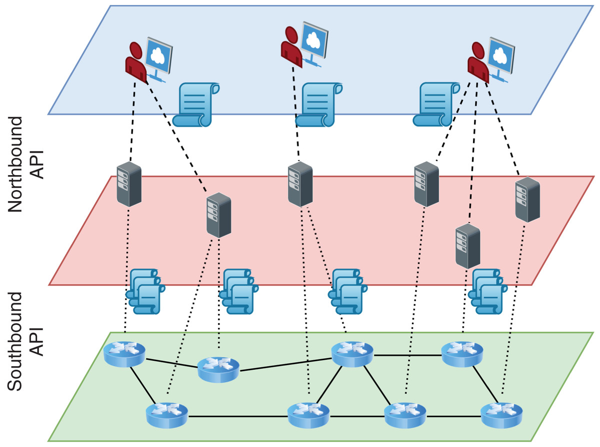
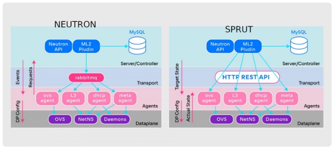
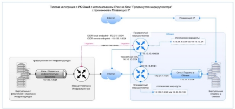
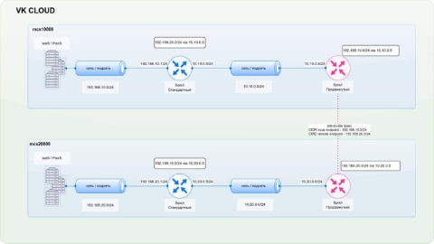
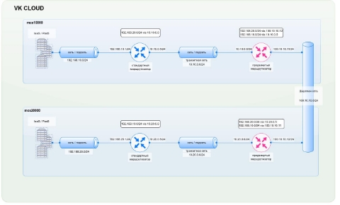
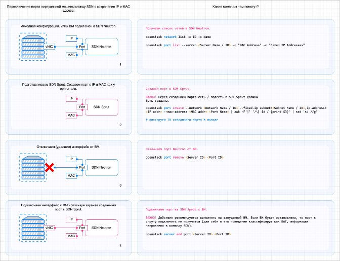
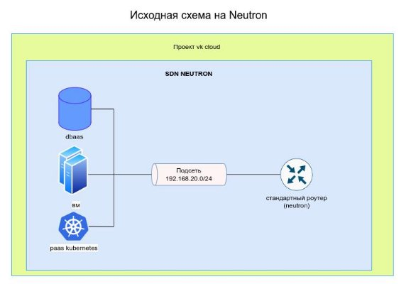
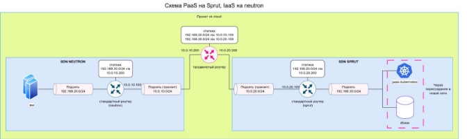

<a name="_page16_x0.00_y249.64"></a>Полное руководство по миграции на SDN SPRUT

В данном руководстве описаны причины и премущества миграции с SDN Neutron, на SDN Sprut. Приведены лучшие практики, типовые кейсы и способы миграции сервисов VK CLOUD.

- [Для чего нужна миграция](#_page0_x0.00_y451.12)
  - [Что такое sdn](#_page0_x0.00_y486.60)
  - [Чем sprut отличается от neutron](#_page0_x0.00_y575.74)
  - [Преимущества миграции](#_page1_x0.00_y408.15)
- [Сбор предварительных данных перед миграцией](#_page1_x0.00_y471.41)
- [Ограничения, к которым нужно быть готовым](#_page1_x0.00_y721.20)
  - [Смена плавающих ip](#_page2_x0.00_y81.64)
    - [Описание](#_page2_x0.00_y110.03)
    - [Решение](#_page2_x0.00_y175.46)
- [Как мигрировать](#_page2_x0.00_y236.66)
  - [IaaS](#_page2_x0.00_y348.52)
    - [Сети](#_page2_x0.00_y376.91)
      - [общая схема](#_page2_x0.00_y401.74)
      - [terraform](#_page6_x0.00_y226.61)
    - [Ipseс](#_page6_x0.00_y302.33)
    - [Балансировщики](#_page8_x0.00_y131.66)
    - [Виртуальные машины](#_page8_x0.00_y254.85)
      - [общая схема](#_page8_x0.00_y279.68)
    - [Подготовительные шаги.](#_page9_x0.00_y175.50)
      - [terraform](#_page14_x0.00_y459.86)
    - [NFS/CIFS](#_page16_x0.00_y129.53)
      - [общая схема](#_page16_x0.00_y154.35)
  - [PaaS](#_page16_x0.00_y249.64)
    - [Kubernetes](#_page17_x0.00_y232.09)
      - [общая схема](#_page17_x0.00_y256.91)
    - [DbaaS](#_page17_x0.00_y381.75)

# Для чего нужна миграция
## Что такое sdn
Software Defined Network — концепция выведения сетевых функций из специализированного железа на программный уровень и дальнейшего разделения ответственности на разные слои.

За счёт SDN в облаке реализуется маршрутизация, firewall и сетевая связность между сервисами в целом.



## Чем sprut отличается от neutron

Долгое время в vk cloud использовался neutron, sdn входящий в openstack, но параллельно разрабатывалось собственное решение sdn - sprut, которое решает проблемы в архитектуре neutron, связанные с масштабируемостью и надёжностью.

На данной схеме предоставлена архитектура и схема работы обоих SDN. Подробнее в отдельной [статье](https://habr.com/ru/companies/vk/articles/763760/).



1. Для sprut агентов предусмотрена возможность постоянного сбора информации о настройках Data plane при помощи HTTP API.

   В neutron конфигурация доставляется при помощи очереди, без проверки что она действительно пришла. В случае ошибок в конфигурации необходима пересборка портов, то есть full sync, который занимает время. 

2. В sprut больше нет событийной модели общения между компонентами. Теперь агенты всегда получают от сервера целевое состояние, в котором должны быть, и непрерывно перезапрашивают его. Получился аналог постоянного Full Sync, при котором агенты сравнивают текущее состояние Data plane с целевым состоянием от сервера, накладывают необходимый diff на Data plane и приводят его к актуальному состоянию. В теории автоматического управления такой подход называют замкнутым контуром управления. 
2. RabbitMQ заменён обычным HTTP REST API. Он лучше справляется с большими массивами данных о таргетном состоянии агентов, его проще разрабатывать и мониторить. Пропала ещё одна потенциальная точка отказа.

## Преимущества миграции

1. Повышение отказоустойчивости инфраструктуры, быстрое восстановление портов в случае выхода из строя сетевой инфраструктуры.
1. Переход на новый поддерживаемый sdn.

# Сбор предварительных данных перед миграцией

В начале необходимо собрать информацию по сетевой инфраструктуре всех проектов при помощи опросника.

1. Используется ли в облачном проекте Shared Network?
1. Используется ли в облачном проекте Shadow Port?
1. Используется ли в облачном проекте Floating IP?
1. Используется ли в облачном проекте публичный DNS?
1. Используется ли прямое подключение к сети ext-net?
1. Использует ли клиент сервис GSLB (Global Server Load Balancer)? ВАЖНО! Сервис является внешним по отношении к инфраструктуре VK Cloud.
1. Используется ли в облачном проекте IPsec VPNaaS?
1. Наличие статических маршрутов на базе Subnet / Router.
1. Наличие виртуальных машин пропускающих трафик (маршрутизаторы / балансировщики / прокси / межсетевые экраны).
1. Используются ли платформенные балансировщики нагрузки?
1. Используются ли правила L7 для платформенных балансировщиков? Если да, то какие именно правила (список)?
1. Есть ли сертификаты на платформенных балансировщиках?
1. Количество кастомных групп безопасности (Security Groups) и их привязка к портам ВМ.
1. Имеется ли в облачном проекте сетевой стык (приложить ссылку в Confluence)?
1. Уровень взаимосвязей между рассматриваемым в облачным проектом и другими облачными проектами заказчика.
1. Какие платформенные сервисы используются в облачном проекте?
1. Используется ли файловое хранилище nfs/cifs?

# Ограничения, к которым нужно быть готовым

Миграция с neutron на sprut процесс, требующий дополнительные действия с точки зрения сетевой инфраструктуры. 

## Смена плавающих ip

## Описание

Для предоставления белых ip адресов (плавающих, либо получаемых при прямом подключении) в SDN NEUTRON используется сеть ext-net, в которой имеются подсети с диапазоном белых ip адресов. 

Для SDN SPRUT используется такая же сеть, но с названием internet и с другим диапазоном адресов подстей.

Решение

В ходе миграции нужно учитывать замену белых ip. Белые плавающие ip можно создать заранее и передать сторонним организациям (если такие есть), чтобы они заранее ввели новые ip в белые списки

Как мигрировать

Процесс миграции может быть выполнен различными инструментами, в зависимости от сервиса и времени техокна (время когда сервис не будет работать).

Самый простой способ - пересоздание инфраструктуры в терраформе. В таком случае необходимо выполнить бэкапы/снапшоты тех вм и баз данных, где хранится состояние, так как терраформ при пересоздании удалит исходные жёсткие диски.

Другие способы, требующие меньшего техокна, будут описаны ниже.

IaaS

Сети

общая схема

В начале необходимо создать на sprut аналогичные базовые сетевые сущности, которые были на netron:

1. Маршрутизаторы со всеми статическими маршрутами
1. Сети и подсети с такими же адресами сети, шлюзами, маршрутами. 

   Случай, когда в подсети подключен одновременно PaaS и IaaS рассмотрен ниже во вкладке DbaaS.

3. Секьюрити группы. Можно создать и скопировать правила при помощи скрипта

[copy-security-group.sh](../copy-security-group.sh)

```bash
./copy-security-group.sh --group-mapping=<id группы на нейтроне 1>=<id группы на спруте 1>,<id группы на нейтроне 2>=<id группы на спруте 2>,... \
--groups=<группа на нейтроне которую нужно скопировать 1>,<группа на нейтроне которую нужно скопировать 2>,...
```
--group-mapping - параметр нужен для правил, где в качестве источников указан не cidr, а другая секьюрити группа. Так как исходные id групп отличаются от целевых, например группы нейтрон all и спрут all, при этом названия у них одинаковые, необходимо через личный кабинет достать id и передать их в скрипт.
--groups - список групп на нейтроне, которые будут скопированы

> [!WARNING]
> В проекте по умолчанию доступна только группа default-sprut (в веб интерфейсы называется default) на sprut. Остальные группы будут доступны после [создания ВМ](https://cloud.vk.com/docs/ru/computing/iaas/service-management/vm/vm-create) с такими группами в сети sprut. Вм можно будет потом сразу удалить.

## terraform

Можно скопировать описание всех сетевых объектов, которые уже имеются на neutron, добавить в названии и аттрибуте name постфикс -sprut и применить изменения, не забыв в зависимостях указать новые названия.

Сеть для интернета также будет изменена с ext-net на internet.

## Ipseс

- Туннели с одинаковыми селекторами (исходные и целевые диапазоны подсетей) не могут существовать одновременно, даже если они на разных sdn. Это означает, что создать аналогичный neutron туннель на sprut заранее нельзя, так как это приведёт к проблемам в работе с исходного.
- Для миграции можно заранее заготовить манифест terraform, который будет описывать туннель на sprut, также это можно сделать для туннеля на neutron для отката миграции при необходимости. Когда будет выполнятся миграция, исходный туннель на neutron необходимо удалить и применить манифест для туннеля на sprut, либо создать его через графический интерфейс, но это займёт больше времени.
- Необходимо помнить, что туннель создаётся с обоих сторон и клиент на другой стороне должен также быть готов удалить старый и принять новый туннель.
- Для построения ipsec туннелей на sprut необходимо использовать продвинутый маршрутизатор, а не стандартный как для neutron.

  

  Данную схему можно преобразовать в такую, для сохранение описанного функционала

  

  Данная схема необходима, так как сети подключенные к продвинутому роутеру не поддерживают плавающие ip адреса. Подключение продвинутого и стандартного роутера через транзитную сеть позволяет передать всю маршрутизацию роутерам. Никакие маршруты по dhcp передавать не нужно.

- В случае, если Ipsec используются для организации сетевой связности между разными проектами vk cloud переключение выполнить проще но

  

  Рекомендуется заменить её на схему с шаренной сетью, shared network, так как это более производительно и надёжно. Стандартную сеть можно сделать доступной сразу в нескольких проектах, для этого нужно сделать запрос в техподдержку.

  

- Для работы SNAT, то есть наличия доступа выхода в интернет, подсеть должна быть подключена к стандартному, а не продвинутому маршрутизатору.
- К одной сети нельзя подключить несколько стандартных роутеров без админских прав, которые есть у техподдержки.
- Мы используем продвинутые роутеры для подключения проектов к шаренной сети.
- Между стандартным и продвинутым маршрутизатором мы строим транзитную сеть. Для каждого стандартного маршрутизатора нужна отдельная транзитная сеть.
- Необходимо прописать соответствующие статические маршруты на стандартных и продвинутых маршрутизаторах.

## Балансировщики

- Сервис одинаков для neutron и sprut, но для миграции его необходимо пересоздать, так как у балансировщика нельзя заменить сеть.
- Можно пересоздать в terraform, указав сеть sprut в описании манифеста и подключить виртуальные машины уже после их миграции.
- Можно создать балансировщик вручную и указать вм в правилах.
- В разработке скрипт для создания копии балансировщика и с назначением всех виртуальных машин.

## Публичный DNS

- В связи со сменой плавающих ip необходимо отредактировать текущие A-записи.
- Если используется внешний сервис dns, изменить записи в нём.

# Виртуальные машины

## Общая схема

Для миграции виртуальных машин используется скрипт migrator-multiple.sh, который работает по следующему алгоритму:



Сценарий предполагает выполнение последовательности действий, которая позволит переключить сетевой интерфейс ВМ в новый SDN. При этом важно помнить, что данная операция выполняется с разрывом сетевой связности.

Классификация виртуальных машин по сложности мигрирования.

Красный - несколько сетевых интерфейсов, вм выступает в роли роутера/прокси/пограничного файерволла.

Рекомендуется вручную мигрировать данную виртуальную машину без скрипта, так как скрипт предназначен для вм с одним портом.

Жёлтый - вм с плавающим ip либо с прямым подключением к сети ext-net.

Необходимо создать заранее плавающий ip в sprut и указать его id в конфиг файле скрипта.

В случае с прямым подключением ext-net рекомендуется перейти на плавающий ip, либо пересоздать вм.

Зелёный - один сетевой интерфейс в серой сети без плавающего ip.

## Подготовительные шаги.

1. В проекте VK Cloud создана ВМ с подключением к виртуальной сети, принадлежащей SDN Neutron.
1. В проекте VK Cloud создана новая сеть в SDN Sprut c подсетью, настройки которой повторяют настройки подсети, созданной в сети Neutron.
1. Подготовлено рабочее место администратора (ВМ с ОС Linux) с установленными компонентами OpenStack CLI, файл конфигурации отправлен в source и вызовы CLI проходят без ошибок.
1. На рабочее место администратора перенесен скрипт автоматизации.
1. Определен сервер, порт которого будет переключаться (логическое имя сервера).
1. Выполнена проверка о наличии аналогичных нейтроновским секьюрити групп на спруте. Их имя должно иметь постфикс -sprut (исключение базовые группы создаваемые по умолчанию вроде: default,all).

   Скрипт:
   [check-if-all-sprut-sg-present.sh](../check-if-all-sprut-sg-present.sh)


7. Запустить скрипт миграции:

Для запуска скрипта:

```bash
./migrator-multiple.sh --all-secgroup-sprut-id=<id группы all на спруте>  <csv файл с описанием мигрируемых ВМ>
```
--all-secgroup-sprut-id - так как в проекте будет 2 группы all для neutron и sprut, необходимо указать id в sprut, так как openstack cli неспособен различить принадлежность секьюрити группы к sdn.

csv файл с описанием мигрируемых вм имеет следующий формат:

имя вм1,имя сети sprut,имя подсети sprut,<опционально: id плавающего ip на спрут, который назначится> имя вм2,имя сети sprut,имя подсети sprut

[migrator.sh](../migrator.sh)

После миграции может возникнуть необходимость перезагрузить dhclient на вм

Для Windows:
```bash

ipconfig /release
ipconfig /renew 
```

Для Lunix:
```bash
dhclient
```

## terraform

Как было сказано ранее, можно мигрировать вм на другой sdn при помощи terraform, что требует пересоздания вм. Миграция через скрипт, описанный выше также приведёт к пересозданию вм, если выполнить terraform apply. 

Это возникает из-за того, что id портов вм меняются, так как скрипт создаёт новые порты. Чтобы избежать пересоздания, необходимо поправить state указав новую сеть, на которую ссылается terraform, а также исправить state файл. 

Вм может быть много и менять стейт вручную неудобно, следующий скрипт позволяет собрать информацию о вм, которые были мигрированы и подготовить новый скрипт, правящий состояние terraform:

[modify_terraform_state.sh](../modify_terraform_state.sh)
Для запуска:

```bash
modify_terraform_state.sh <стейт файл терраформа>
```

Если не указать в параметрах стейт файл терраформа, будет использоваться текущий файл terraform.tfstate Необходимо в коде терраформе также указать новые сети у вм.

## NFS/CIFS

### Общая схема

Файловое хранилище поддерживает бэкапы, однако их нельзя поднять в сети другого sdn. Необходимо:

1. Создать аналогичное хранилище в sprut сети.
1. Создать вм 1-2 и подключить её к сетям старого и нового хранилищь.
1. Выполнить подключение на вм к обоим хранилищам и запустить rsync и перелить данные в новое хранилище. 

### PaaS

Общая схема миграции подразумевает создание копии PaaS в сети neutron и переноса нагрузки при помощи встроенных средств бэкапирования. Для простоты решения рекомендуется остановить кластеры на запись, пока выполняется перенос.





В данной схеме можно использовать продвинутый роутер в качестве связности neutron и sprut.

## Kubernetes

### Общая схема

1. Создаём аналогичный кластер в новой сети sprut. В случае если в сети помимо кластера kubernetes есть другие сервисы или виртуалки, адрес сети на sprut, где размещён kubernetes должен отличаться от исходного.
1. Переносим нагрузку при помощи средства бэкапирования velero, в том числе pv. Примеры использования velero находятся в инструкции: <https://github.com/IlyaNyrkov/k8s-velero-vkcloud-workshop>
1. Внешние ip балансировщиков будут другие на новом кластере.
1. Подключаем продвинутый роутер к транзитным сетям с исходным и новым роутером на спруте. Прописываем необходимую статику как на схеме выше.
1. Проверяем функционирование приложения.
1. Удаляем старый кластер.

## DbaaS

1. Останавливаем исходную базу данных на запись и делаем снапшот. Альтернативно можно использовать pgdump и другие встроенные средства бэкапирования баз данных.
1. Из бэкапа поднимаем базу данных в новой сети.
1. Строем перемычку с виртуальными машиными при помощи продвинутого роутера.
1. Правим конфиги вм, чтобы они ходили в бд с новым адресом.
1. Удаляем исходную бд.

