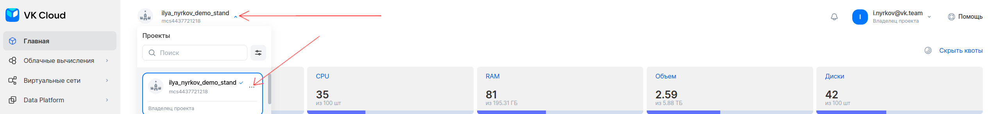
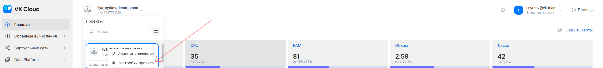
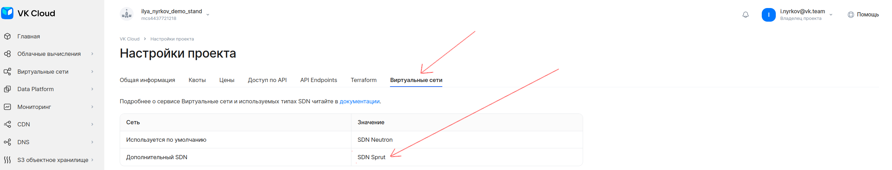
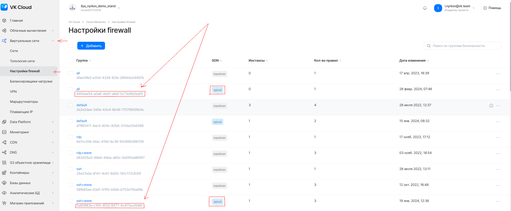

Набор скриптов и инструкций для миграции виртуальных машин в SDN Sprut.

О том что такое SDN, какие функциональные и нефункциональные премимущества между Neutron и Sprut смотрите [полное руководство](docs/complete_guide_to_migrating_to_SDN_SPRUT.md).

Подробное описание каждого скрипта в [документе](docs/scripts.md).

Для того, чтобы опробовать скрипты для миграции на тестовых стендах, можно воспользоваться примерами в папке [examples](examples/).

Миграция с neutron на sprut процесс, требующий дополнительные действия с точки зрения сетевой инфраструктуры. 

## Базовый кейс миграции проекта на IaaS

Схема последовательности действий при миграции. Схема для миграции кейса с PaaS доступна в [полном руководстве](docs/complete_guide_to_migrating_to_SDN_SPRUT.md).

_алгоритм_миграции_нейтрон_спрут.png)

0. Подготовить интеграционные/ручные или другие тесты, для проверки функционирования системы после миграции.
1. В проекте должен быть включен SDN Sprut, проверить это можно нажав на название проекта

три точки -> настройка проекта → вкладка "Виртуальные сети". 



Если SDN Sprut отсутсвует, то нужно oтправить в техподдержку запрос на добавление сети sprut в проект в облаке. В обращении необходимо указать айди проекта/проектов куда нужно добавить сеть sprut. [Контакты техподдержки](https://cloud.vk.com/docs/ru/intro/start/support/support-info).

2. Подготовить рабочее место администратора (ВМ с ОС Linux) с установленными компонентами OpenStack CLI (nova, neutron, octavia), файл конфигурации отправлен в source [инструкция по установке](https://cloud.vk.com/docs/tools-for-using-services/cli/openstack-cli). Можно проверить работу через команду 
```bash
openstack server list -c ID -c Name -c Networks
```
Вывод покажет список виртуальных машин в проекте:
```bash
+--------------------------------------+--------------------------------------------+---------------------------------------------------+
| ID                                   | Name                                       | Networks                                          |
+--------------------------------------+--------------------------------------------+---------------------------------------------------+
| 053c5884-c700-4548-95fb-5a323e9fc55f | mac-vlan-maltus-cni-master-0               | stage-test=10.0.1.23                              |
| a956271f-9bef-4c26-af15-e6bb484ee7f1 | mac-vlan-maltus-cni-worker-group-1-1       | stage-test=10.0.1.31                              |
+--------------------------------------+--------------------------------------------+---------------------------------------------------+
```
3. Перенести на рабочее место администратора необходимые скрипты миграции, либо выполнить на нём ```git clone https://github.com/vk-cs/neutron-2-sprut.git```, для копирования всего репозитория, со всеми скриптами.
4. Подготовить сетевую инфраструктуру. [!WARNING] Новые сущности должны должны иметь в названии постфикс **-sprut**, чтобы названия аналогичных объектов на sprut и neutron не совпадали.
    1. Создать сети и подсети с аналогичными адресами, статическими маршрутами. 
    2. Создать аналогичные роутеры с аналогичными статическими маршрутами и подключить к ним новые сети.
    3. Создать секьюрити группы, для этого можно использовать [скрипт](copy-security-group.sh).
    4. Создать плавающие ip. Они будут иметь отличные от исходных адреса. В разработке находится возможность переноса адресов с нейтрона на спрут, требуется уточнить об этом перед выполнением миграции. Создание адресов заранее позволит до миграции согласовать все адреса с внешними системами.
    5. Выполнить проверку о наличии аналогичных нейтроновским, секьюрити групп на спруте. Их имя должно иметь постфикс **-sprut** (исключение базовые группы создаваемые по умолчанию вроде: default,all). Можно использовать [скрипт](check-if-all-sprut-sg-present.sh). 
    
    ```bash
    ./check-if-all-sprut-sg-present.sh
    ```

    Скрипт проверит порты каждой виртуальной машины, какие там назначены группы и есть ли аналогичные на sprut.
    ```shell
    Checking VM: mac-vlan-maltus-cni-master-0
    Security groups found on VM mac-vlan-maltus-cni-master-0: mac-vlan-maltus-cni-base
    ```

    Скрипт выведет информацию, если не найдёт аналогичную группу
    ```shell
    Checking for corresponding '-sprut' security group for: mac-vlan-maltus-cni-base
    Missing corresponding '-sprut' group for: mac-vlan-maltus-cni-base
    ```

    В конце будет отображён полный список недостающих групп:
    ```shell
    Security Group Check Summary
    ------------------------------------
    The following security groups do not have corresponding '-sprut' groups:
    - mac-vlan-maltus-cni-base
    ```

5. Подготовить список виртуальных машин для миграции, посмотреть количество сетевых подключений. Скрипт для миграции способен переносить вм только с одним сетевым подключением. Можно использовать команду:
```bash
openstack server list -c ID -c Name -c Networks
```

Пример вывода:
```shell
+--------------------------------------+--------------------------------------------+---------------------------------------------------+
| ID                                   | Name                                       | Networks                                          |
+--------------------------------------+--------------------------------------------+---------------------------------------------------+
| 7fb03142-4825-47bc-954a-bbadc89a94d6 | vm_1                                       | test-sprut=10.0.0.64; vpn_net=10.0.0.13, 10.0.0.6 |
| 8f0d6d98-cd80-452f-b4cc-7aecff42c149 | migration-target-master-0                  | vpn_net=10.0.0.29                                 |
| 02fe2cde-6526-4fcc-a80a-d996d6482894 | migration-target-default-group-0           | vpn_net=10.0.0.31                                 |
+--------------------------------------+--------------------------------------------+---------------------------------------------------+
```
В разделе network указано количество подключений у виртуальной машины.

6. Подготовить файл со списком мигрируемых для виртуальных машин [скрипта миграции](migrator-multiple.sh).

Формат .csv файла (разделитель символ запятая ,):
```shell
<имя виртуальной машины для миграции>,<имя целевой сети на спруте>,<имя целевой подсети на спруте>,<id плавающего ip sprut>
<имя виртуальной машины для миграции>,<имя целевой сети на спруте>,<имя целевой подсети на спруте>,<id плавающего ip sprut>
...
```

Пример файла migration-inputs.csv:
```csv
migration-target-master-0,vpn_net-sprut,vpn_subnet-sprut
migration-target-default-group-0,vpn_net-sprut,vpn_subnet-sprut
```
7. Выделить техническое окно, во время которого сервисы могут не работать. На время переключения виртуальная машина потеряет сетевую связность. На одну виртуальную машину уходит ~45 секунд. 
8. Запустить скрипт миграции.

```bash
./migrator-multiple.sh <название csv файла>
```

Если используются секьюрити группы ssh+www, all, для копирования их во время миграции необходимо указать флаги:

```bash
./migrator-multiple.sh <название csv файла> \
 --all-secgroup-sprut-id=<id группы на спруте> \
 --ssh-www-secgroup-sprut-id=<id группы на спруте>
```

ID можно посмотреть в графическом интерфейсе "Виртуальные сети" -> "Настройки firewall" и посмотреть аналогичные группы с тегом "Sprut".



После запуска скрипта оследовательно для каждой вм будет такой вывод:

```shell
Processing migration for server: yaklass-private-0
Executing step 1: Capturing port information
Migrated port yaklass-private-0_migrated_port exists, checking for attachment...
Source Port ID is:        8044ec65-3340-497a-9338-bdd6c47cec0e
Source Port IP Addr is:   192.168.199.28
Source Port MAC Addr is:  fa:16:3e:cd:39:fc
********************************************
Executing step 2: Capturing server ID and security group names
Server ID is:             e12ee46f-33ed-481a-848f-78a58b12cda8
Security Groups captured: default
********************************************
Executing step 3: Creating port with source IP and MAC
Port named yaklass-private-0_migrated_port already exists. Port ID: af3194a6-40be-447a-b0b5-ffe0f3db2c21
********************************************
Executing step 4: Disconnecting existing port from server
Running command: openstack server remove port e12ee46f-33ed-481a-848f-78a58b12cda8 8044ec65-3340-497a-9338-bdd6c47cec0e
Step 4 complete (Source port disconnected from server yaklass-private-0)
********************************************
Executing step 5: Connecting new port to server
Running command: openstack server add port e12ee46f-33ed-481a-848f-78a58b12cda8 af3194a6-40be-447a-b0b5-ffe0f3db2c21
Step 5 complete (New port attached to server)
********************************************
Executing step 6: Setting security groups on new port
Setting captured groups: default
Original Security Group: default
Modified Security Group ID: d7881417-4ac4-404c-82b6-311da32b6386
Running command: openstack port set --security-group d7881417-4ac4-404c-82b6-311da32b6386 af3194a6-40be-447a-b0b5-ffe0f3db2c21
Security Group default set on new port
Step 6 complete (Security groups assignment complete)
********************************************
Executing step 7: Attaching Floating IP
Running command: openstack floating ip set --port af3194a6-40be-447a-b0b5-ffe0f3db2c21 f45b8672-02f3-4b2c-a4c3-b7d46662b5f2
Floating IP f45b8672-02f3-4b2c-a4c3-b7d46662b5f2 attached to new port
********************************************
Migration completed for server: yaklass-private-0
```

После вывода сообщения о последней вм в списке миграция прошла.

```shell
Migration completed for server: yaklass-private-1
---------------------------------------
Elapsed time: 128 seconds
```

9. Перезагрузить на виртуальных машинах dhclient.

Для Windows:

```
ipconfig /release
ipconfig /renew
```

Для Linux:
```bash
dhclient
```

10. При наличии на нейтроне, создать аналогичные балансировщики нагрузки в сетях на sprut.
11. Проверить работу инфраструктуры и сервисов.